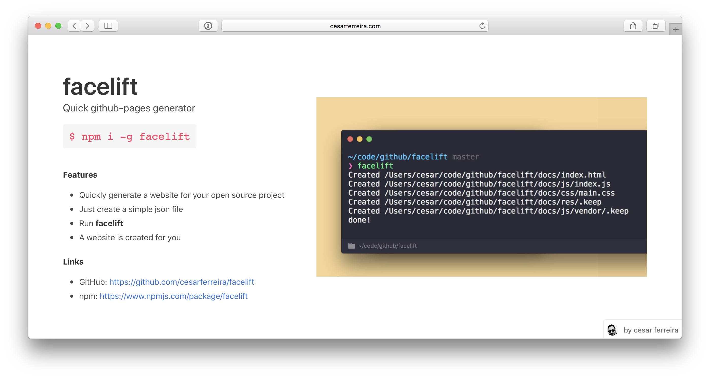
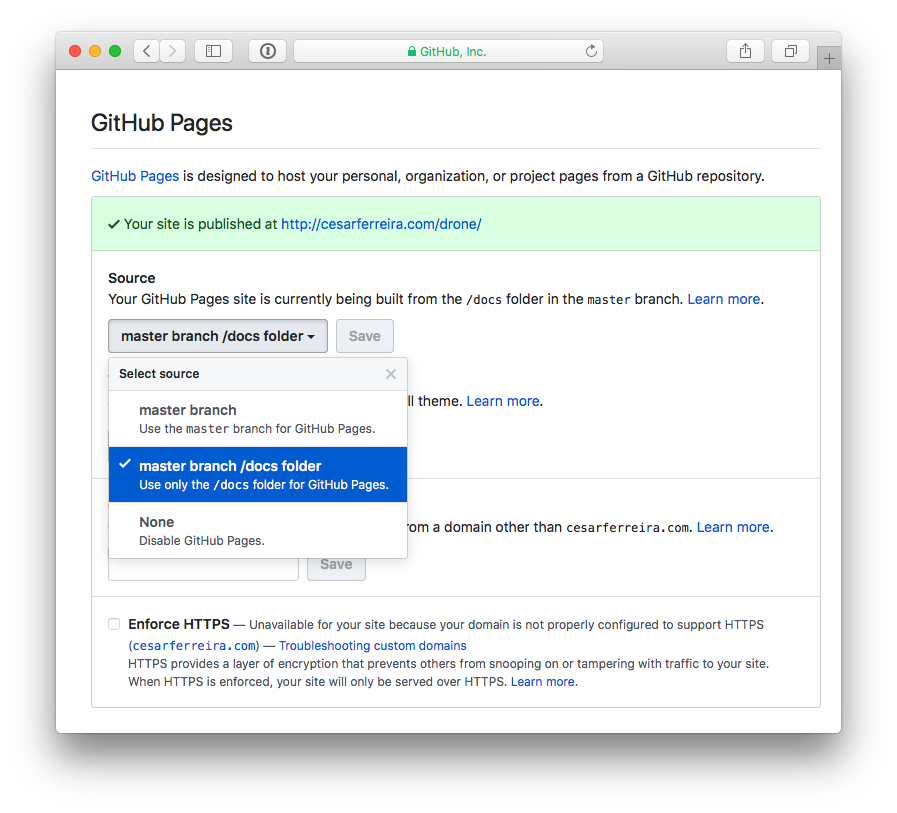
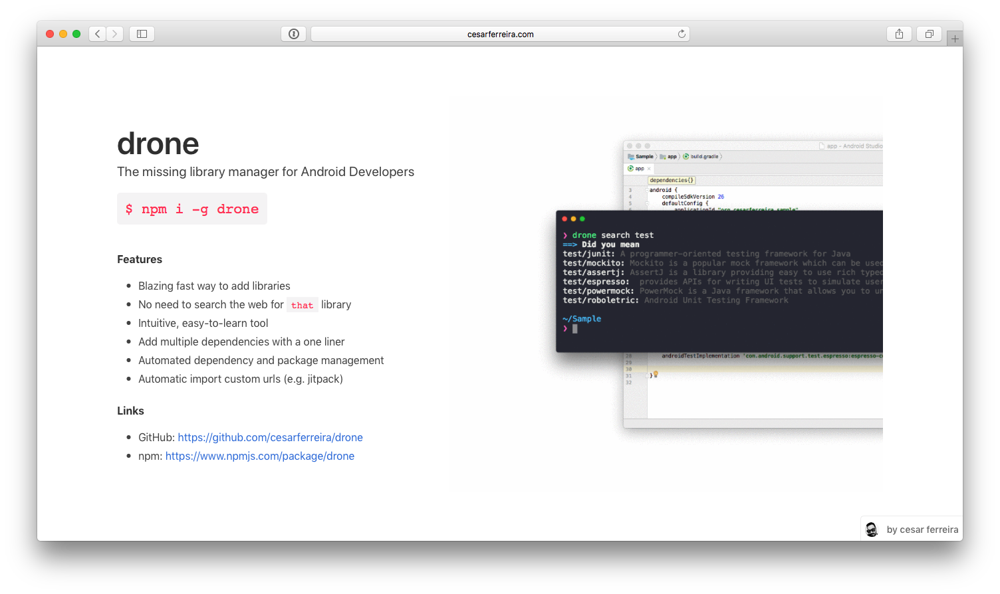

# facelift
> Quick github-pages generator

<p align="center">
  
</p>

<p align="center">
  <a href="https://travis-ci.org/cesarferreira/facelift"></a>
  <a href="https://www.npmjs.com/package/facelift"></a>
  <a href="https://www.npmjs.com/package/facelift"></a>
  <a href="https://github.com/cesarferreira/facelift/blob/master/LICENSE"></a>
</p>

## Install

```sh
npm install -g facelift
```

## Usage

```
Usage

   $ facelift

```

This will use the `facelift.json` file to generate the `docs/` folder with the website content.


## Example of a `facelift.json` for [drone](https://github.com/cesarferreira/drone)

```json
{
    "title": "drone",
    "subtitle": "The missing library manager for Android Developers",
    "installation": "npm i -g drone",
    "screenshot": "http://cesarferreira.com/drone/res/add4.gif",
    "author": {
        "name": "cesar ferreira",
        "thumbnail": "https://pbs.twimg.com/profile_images/884351017097322496/2mmpORsM_400x400.jpg",
        "homepage": "http://cesarferreira.com"
    },
    "highlights": [
        {
            "title": "Features",
            "items": [
                "Blazing fast way to add libraries",
                "No need to search the web for that library",
                "Add multiple dependencies with a one liner",
                "Automated dependency and package management",
                "Automatic import custom urls (e.g. jitpack)",
                "Intuitive, easy-to-learn tool"
            ]
        },
        {
            "title": "Links",
            "items": [
                "GitHub: https://github.com/cesarferreira/drone",
                "npm: https://www.npmjs.com/package/drone"
            ]
        }
    ]
}
```

### `git add` and `push` your code to your `remote`.


### Head to your https://github.com/USERNAME/REPO/settings, scroll down to Github Pages and change the source to __master branch /docs folder__.

<p align="center">
  
</p>

### This will generate this [website](http://cesarferreira.com/drone/)

<p align="center">
  
</p>

## Created by
[Cesar Ferreira](https://cesarferreira.com)

## License
MIT © [Cesar Ferreira](http://cesarferreira.com)
